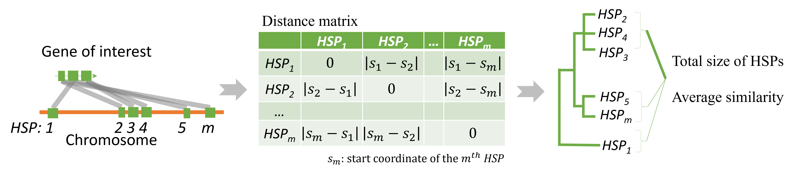
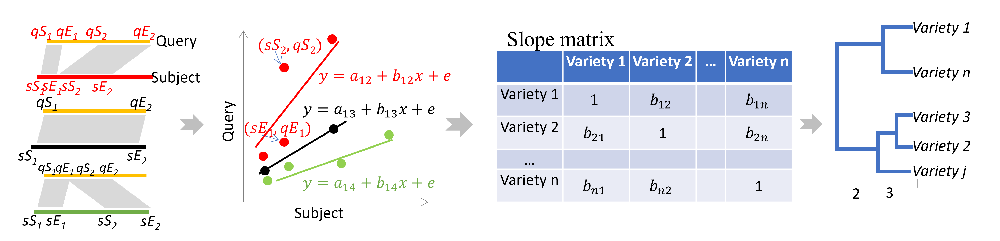

#### Introduction
_CHOICE_ and _CLIPS_ are two unsupervised learning algorithms developed to implement [BRIDGEcereal](https://bridgecereal.scinet.usda.gov/) webapp, which is constructed to survey and graph large indel based haplotype graph from publicly accessible pan-genomes for a gene of interest.

A large indel, if presents, is indicated by two flanking High-scoring Segment Pairs (HSPs) for a pair of segments identified by [Blastn](https://www.ncbi.nlm.nih.gov/books/NBK279690/). A Pan-genome with multiple assemblies enables the possibility to identify large indels from a gene of interest through the desired All-vs-All comparison. However, two main challenges are:
1. Identification of the segment containing the ortholog from each assembly.
2. Visualization of identified indels from a large number of assemblies.

_CHOICE_ and _CLIPS_ are developed to tackle these two challenges, respectively.

#### _CHOICE_ illustration
_CHOICE_, Clustering HSPs for Ortholog Identification via Coordinates and Equivalence, identifies and extracts the segment harboring the ortholog from each assembly.

#### Demonstration CHOICE with TraesCS4A02G058900 in chromosome 4A of **Chinese Spring**
(R library *dendextend* and *data.table* are required to go through the demonstration)

CDS of TraesCS4A02G058900 is searched against chr4A of each assembly (11 in total) via Blastn. The Blastn output (-outfmt 6) is reorganized as [TraesCS4A02G058900_syn.txt](./data/TraesCS4A02G058900_syn.txt), which is the input for _CHOICE_. _CHOICE_ which will determine the region of each assembly contain the ortholog. For example, the coordinates for variety **spelta** are from 52,231,267 to 52,245,777, while are from 52,859,043 to 52,873,560 for variety **lancer**. The coordinates will be then used to exact the corresponding segment out from each assembly. Two output files (CHOICE_summary.txt and Filtered_By_CHOICE.txt) will be also saved.

These segments are then blasted against each other via Blastn (-outfmt 6). The output file [TraesCS4A02G058900_seg-Self_out_m6.txt](./data/TraesCS4A02G058900_seg-Self_out_m6.txt) is then fed into _CLIPS_. The clustering tree suggests two main haplotypes for this gene: one is only detected in by **Chinese Spring**, while another haplotype is shared by all other varieties. One output file "slope_matrix_output_from_CLIPS.txt" will be also saved. 

#### _CLIPS_ illustration

CLIPS (Clustering via Large-Indel Permuted Slopes) groups segments sharing the same set of indels into haplotypes. For a pair of segments, the slope estimate is one when large indels are absent, but deviates from one when large indels are present.

#### Illustration of CLIPS
Visualize the alignments and slope estimates by adjusting HSP parameters in the first coding block. 

#### Citation
Zhang B, Huang H, Tibbs-Cortes LE, Vanous A, Zhang Z, Sanguinet K, Garland-Campbell KA, Yu J, Li X. Streamline unsupervised machine learning to survey and graph indel-based haplotypes from pan-genomes. bioRxiv. 2023. doi: [10.1101/2023.02.11.527743](https://doi.org/10.1101/2023.02.11.527743)
